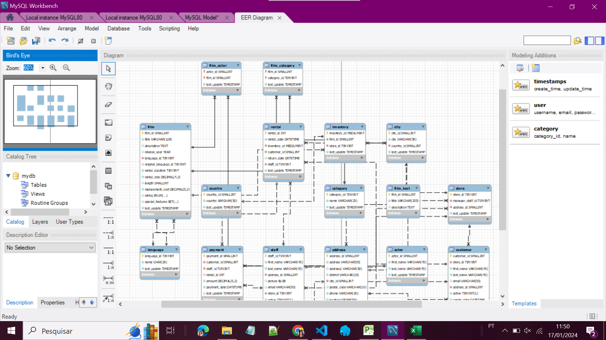
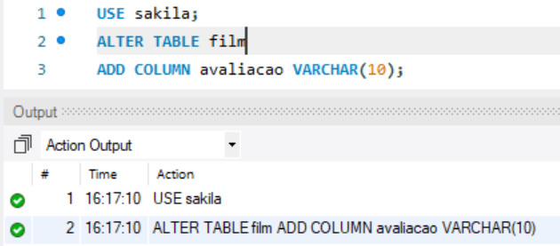
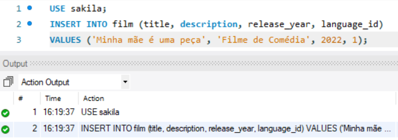
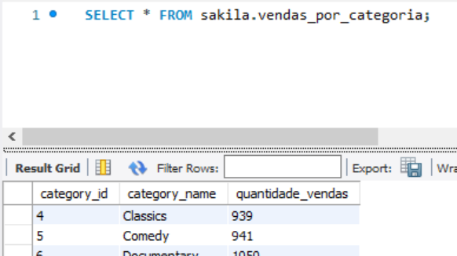
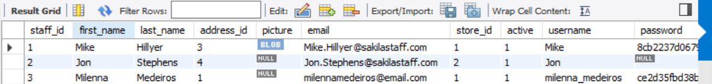
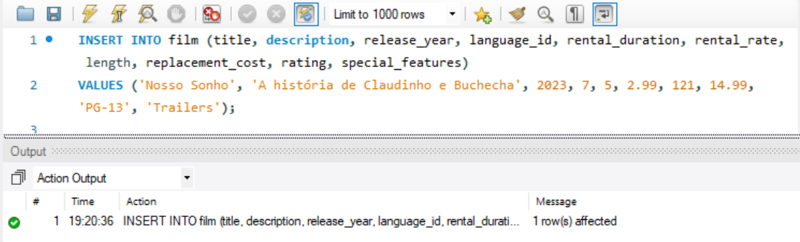

# Estudos na Base de Dados Sakila

Sakila é uma base de dados de exemplo, utilizada para fins de treinamento e prática em sistemas de gerenciamento de bancos de dados relacionais. Ela foi criada para ser uma representação simplificada de um sistema de gerenciamento de locadora de DVDs, com tabelas que incluem informações sobre filmes, atores, lojas, aluguéis e outras entidades relacionadas.

## 📌 Índice

- <a href="diagrama-sakila">Digrama Sakila</a>
- <a href="#tabelas">Tabelas</a>
- <a href="#instrucoes-dml-e-ddl">Instruções DML e DDL</a>
- <a href="#views">Views</a>
- <a href="#stored-procedures">Stored Procedures</a>
- <a href="#triggers">Triggers</a>
- <a href="#conclusao">Conclusão</a>
- <a href="#autora">Autora</a>

## 🇪🇷 Diagrama Sakila

<div style="text-align: center;">

<p style="text-align: center;"><em>Diagrama ER na base de dados Sakila</em></p>
</div>
O diagrama Entidade-Relacionamento Estendido (EER) da base de dados Sakila é uma representação visual que descreve a estrutura e as relações entre as entidades no modelo de dados.

## 📋 Tabelas

- **film**: Contém informações sobre os filmes disponíveis, como título, descrição, ano de lançamento, etc.

- **actor**: Armazena dados sobre os atores que participam dos filmes.

- **film_actor**: Associa atores a filmes.

- **film_category**: Associa filmes a categorias.

- **inventory**: Contém informações sobre o estoque de DVDs disponíveis para aluguel.

- **rental**: Armazena dados sobre os aluguéis de DVDs, como datas, cliente e filme alugado.
  
- **address**: Armazena informações sobre os endereços associados aos locais da loja e clientes. ***Campos Relevantes***: Endereço, cidade, código postal, telefone, etc.

- **category**: Mantém informações sobre as categorias às quais os filmes pertencem. ***Campos Relevantes***: Nome da categoria.

- **city**: Contém informações sobre as cidades onde estão localizadas as lojas e os endereços dos clientes. ***Campos Relevantes***: Nome da cidade, país associado.

- **country**: Armazena informações sobre os países relacionados às cidades e endereços. ***Campos Relevantes***: Nome do país.

- **customer**: Contém dados sobre os clientes da locadora. ***Campos Relevantes***: Nome do cliente, endereço, e-mail, ativo/inativo, etc.

- **language**: Mantém informações sobre os idiomas disponíveis para os filmes. ***Campos Relevantes***: Nome do idioma.

- **payment**: Armazena dados sobre os pagamentos efetuados pelos clientes nos aluguéis. ***Campos Relevantes***: Valor do pagamento, data, cliente, funcionário, etc.

- **staff**: Contém informações sobre os funcionários da locadora. ***Campos Relevantes***: Nome do funcionário, endereço, e-mail, loja associada, etc.

- **store**: Representa as lojas da locadora. ***Campos Relevantes***: Gerente da loja, localização, horário de funcionamento, etc.

## ✔ Instruções DML e DDL

*Adicionando uma nova coluna chamada 'avaliacao' à tabela 'film'*
```sql
-- DDL é usado para definir e gerenciar a estrutura do banco de dados.
ALTER TABLE film
ADD COLUMN avaliacao VARCHAR(10);
```
<div style="text-align: center;">

<p style="text-align: center;"><em>Alter Table na Tabela Filmes</em></p>
</div>

*Inserindo um novo filme na tabela 'film'*

```sql
-- DML é usado para manipular os dados armazenados no banco de dados. 
INSERT INTO film (title, description, release_year, language_id)
VALUES ('Minha mãe é uma peça', 'Filme de Comédia', 2022, 1);
```
<div style="text-align: center;">

<p style="text-align: center;"><em>Insert na Tabela Filmes</em></p>
</div>

## ✔ Views

Views são conhecidas por serem como uma tabela virtual ou uma consulta armazenada. Com finitas possibilidades, podemos utilizá-las para encapsular consultas complexas, fornecendo uma interface simplificada para os usuários finais ou aplicativos que necessitam de acesso aos dados.

```sql
-- View que mostra vendas por categoria
CREATE VIEW vendas_por_categoria AS
SELECT
    c.category_id,
    c.name AS category_name,
    COUNT(r.rental_id) AS quantidade_vendas
FROM
    category c
JOIN
    film_category fc ON c.category_id = fc.category_id
JOIN
    film f ON fc.film_id = f.film_id
JOIN
    inventory i ON f.film_id = i.film_id
JOIN
    rental r ON i.inventory_id = r.inventory_id
GROUP BY
    c.category_id, c.name
ORDER BY
    c.category_id;
```
A view vendas_por_categoria usa junções (JOIN) para relacionar as tabelas e agrupa os resultados pelo ID e nome da categoria. A contagem de aluguéis é feita usando COUNT(r.rental_id).

<div style="text-align: center;">

<p style="text-align: center;"><em> Resultado da View Vendas por Categoria</em></p>
</div>

## ✔ Stored Procedures

Stored Procedures são procedimentos armazenados no banco de dados que  são compilados e armazenados no banco de dados para serem reutilizados e executados quando necessário.

```sql
-- Criação da Proc Inserir Funcionário
USE `sakila`;
DROP procedure IF EXISTS `insert_staff`;

DELIMITER $$
USE `sakila`$$
CREATE PROCEDURE `insert_staff`(
    IN p_first_name VARCHAR(45),
    IN p_last_name VARCHAR(45),
    IN p_address_id INT,
    IN p_picture BLOB, -- Tipo de dados que pode armazenar dados binários como imagens, multimedia e arquivos PDF.
    IN p_email VARCHAR(50),
    IN p_store_id INT,
    IN p_username VARCHAR(16),
    IN p_password VARCHAR(40)
)
BEGIN
    INSERT INTO staff (
        first_name,
        last_name,
        address_id,
        picture,
        email,
        store_id,
        active,
        username,
        password,
        last_update
    )
    VALUES (
        p_first_name,
        p_last_name,
        p_address_id,
        p_picture,
        p_email,
        p_store_id,
        1,  -- Definindo 'active' como 1 (ativo)
        p_username,
        SHA1(p_password), -- Hashing da senha com SHA-1
        CURRENT_TIMESTAMP
    );
END$$

DELIMITER ;
```
*Depois de criar a stored procedure, é só chamá-la da seguinte forma:*
```sql
CALL insert_staff('Milenna', 'Medeiros', 1, NULL, 'milennamedeiros@email.com', 1, 'milenna_medeiros', 'vida123');
```
<div style="text-align: center;">

<p style="text-align: center;"><em>Tabela Staff</em></p>
</div>

## ✔ Triggers

Triggers (gatilhos) são objetos em bancos de dados que são automaticamente executados em resposta a determinados eventos, como operações de inserção, atualização ou exclusão em tabelas específicas.

```sql
DELIMITER //
-- Trigger para atualizar quando a tabela film for alterada
CREATE TRIGGER `upd_alteracao_filme`
BEFORE UPDATE ON `film`
FOR EACH ROW
BEGIN
    INSERT INTO alteracao_filme (acao, descricao, data)
    VALUES ('Atualizacao', CONCAT('Filme atualizado - ID: ', OLD.film_id), NOW());
END //
DELIMITER ;
```
Com o Trigger criado, criei a Tabela alteracao_filme para registrar as atualizações feitas.
<div style="text-align: center;">

<p style="text-align: center;"><em>Insert de um novo filme</em></p>
</div>

<div style="text-align: center;">

<p style="text-align: center;"><em>Tabela Alteração de Filmes atualizada</em></p>
</div>

## 💻 Conclusão

Ao longo deste projeto, exploramos ferramentas na base de dados Sakila, incluindo:

- [x] Instruções DDL e DML
- [x] Views
- [x] Stored Procedures
- [x] Triggers
  
A utilização eficaz dessas ferramentas proporcionam maior controle sobre as operações no banco de dados, facilitando a manutenção e garantindo a consistência dos dados. Ao aplicar procedimentos armazenados e triggers de forma estratégica, fortalecemos a robustez e eficiência da gestão de informações na base de dados Sakila.

## ⌨ Tecnologias Utilizadas

1. [Mysql Workbench](https://www.mysql.com/products/workbench/)
2. [MySql](https://www.mysql.com/)

## 🙋 Autora


[Linkedin](https://www.linkedin.com/in/milenna-medeiros-515060147/)
